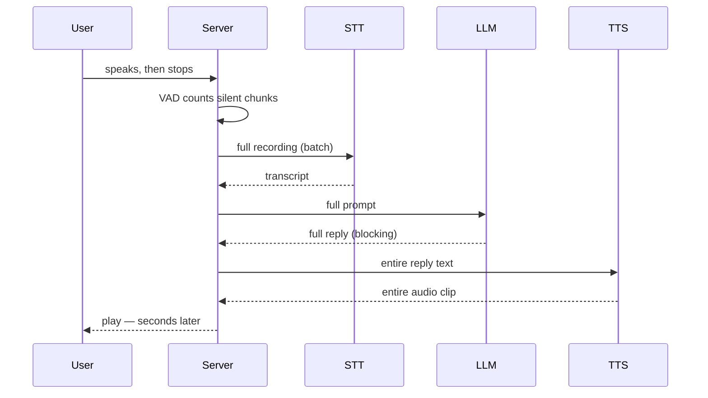
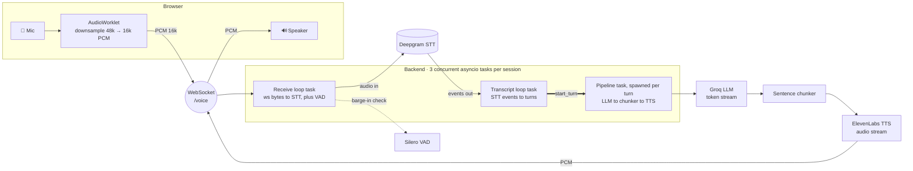
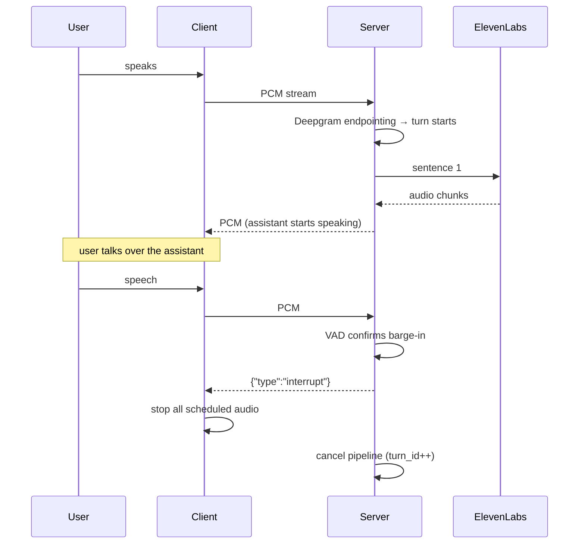

Interject — a full-duplex voice agent you can talk over

# Interject

**A real-time, full-duplex voice AI that you can interrupt mid-sentence.**

Most voice assistants take turns like a walkie-talkie: you talk, you wait, it talks, you wait. Real conversations aren't like that. People overlap, cut each other off, jump in with "no wait, I meant—" halfway through a sentence. I wanted to see how close I could get a voice agent to that feeling, so Interject streams speech-to-text, an LLM, and text-to-speech end-to-end, and — the part I actually cared about — it lets you **barge in** and shut it up the instant you start talking.

This is both the overview and my notes from building it. I'll go through how it works, the rewrite that turned it from a toy into something real-time, the latency numbers from actual sessions (including a measurement mistake that fooled me for a while), and the stuff that's still too slow.

> Built by **Rajat Dugar**. It's not hosted anywhere — clone it and run it yourself (see [Run it yourself](#run-it-yourself)).

---


## Contents

- [What it looks like](#what-it-looks-like)
- [The bar: what "good" sounds like](#the-bar-what-good-sounds-like)
- [v0: the naive prototype](#v0-the-naive-prototype)
- [The rewrite: stream everything](#the-rewrite-stream-everything)
- [Architecture](#architecture)
- [The hard parts](#the-hard-parts)
  - [1. The concurrency model](#1-the-concurrency-model)
  - [2. Turn detection (endpointing)](#2-turn-detection-endpointing)
  - [3. Barge-in](#3-barge-in)
  - [4. Sentence chunking](#4-sentence-chunking-so-tts-can-start-early)
  - [5. Gapless playback in the browser](#5-gapless-playback-in-the-browser)
  - [6. Never block the event loop](#6-never-block-the-event-loop)
- [Measuring latency](#measuring-latency)
- [Results and the road to 500ms](#results-and-the-road-to-500ms)
- [Run it yourself](#run-it-yourself)
- [Tech stack](#tech-stack)

---


## What it looks like

The UI is about as bare as it gets — connect, hit the mic, talk. Status walks through `disconnected → connected → listening → assistant speaking`, and you can cut in whenever you want.


But the UI isn't the point. Everything that matters happens in the gap between you finishing a word and hearing a reply.

---


## The bar: what "good" sounds like

Here's the thing that reframed the whole project for me: in normal human conversation, the gap between one person stopping and the next starting is tiny — usually around **200–300ms**. Once you cross a second or so, it stops feeling like a conversation. You get that stilted "…is it my turn now?" pause that instantly gives away you're talking to a computer.

So really there are three problems hiding in there:

1. **Latency** — how long from *you stop talking* to *you hear something back* (time-to-first-byte, or TTFB). This is the number I obsessed over.
2. **Turn-taking** — figuring out when you're actually *done* versus just taking a breath.
3. **Barge-in** — letting you interrupt, and actually reacting the moment you do.

---


## v0: the naive prototype

The first version — the very first commit, which I honestly labeled `phase1 done not tested` — was a walkie-talkie. A handful of flat modules with global clients and one loop that did everything in order, one step fully finishing before the next started:

```python
# server.py (v0) — record, then run the whole pipeline start to finish
transcript = await stt.transcribe(audio_bytes)      # full utterance → Deepgram REST
reply = await llm.get_response(transcript, history)  # wait for the ENTIRE reply
response_audio = await tts.synthesize(reply)         # synthesize the WHOLE thing
await websocket.send_bytes(response_audio)           # ...then send it all at once
```

Turn-taking was done locally: Silero VAD counted silent chunks, and once there'd been enough silence the pipeline fired. Interrupting wasn't even attempted — it was a `# TODO`.




Nothing came out until the *last* step finished, so you'd say something and then just sit there. It worked, technically, but it felt like submitting a form and waiting for the page to reload. The funny part is the prototype basically wrote its own roadmap — I'd left `# TODO`s all over it that spelled out exactly what to fix:

- `stt.py`: *"TODO: Switch to Deepgram streaming API for real-time partial transcripts"*
- `llm.py`: *"TODO: Switch to streaming (stream=True) and yield partial tokens so TTS can start…"*
- `tts.py`: *"TODO: Use streaming TTS to send audio chunks as they arrive, reducing time-to-first-byte"*
- `server.py`: *"TODO: Add interruption handling…"*

The rewrite is pretty much just me knocking off those four TODOs.

---


## The rewrite: stream everything

The thing that clicked: stop treating STT → LLM → TTS as **steps in a line**, and start treating them as **streams that overlap**. There's no reason the LLM should wait for a fully-decided transcript, or TTS should wait for a finished reply. Ideally the assistant is already *saying its first sentence while the LLM is still writing the rest of the paragraph*.

So, concretely, the rewrite:

- Swapped STT from Deepgram's batch REST endpoint to its **live streaming** WebSocket.
- Moved the LLM to **token streaming** (and off OpenAI `gpt-4o-mini` onto **Groq**, which is stupidly fast to first token).
- Made TTS **forward audio chunks** as they land instead of collecting a whole clip first.
- Handed turn detection over to Deepgram, and demoted VAD to **barge-in only**.
- Put a thin provider abstraction in front of everything (`protocols.py`) so any vendor is swappable.
- Actually built **interruption**, with cancellation tokens on the server and audio flushing on the client.

---


## Architecture




The thing that's easy to miss: the **receive loop** and **transcript loop** are two *separate* `asyncio` tasks running concurrently for the whole session, plus a third **pipeline task** that gets spawned fresh for each turn. The receive loop and transcript loop never call each other — they're completely decoupled through Deepgram's socket. One task just keeps shoving mic audio *in*; the other independently pulls transcripts *out* and decides when a turn is done. That's why the arrows through Deepgram go opposite directions.

Backend is FastAPI + `asyncio`; frontend is React + the Web Audio API. Audio is locked to **16 kHz mono 16-bit PCM** the whole way through — that one format assumption is basically the glue holding every component together.

The swappable seam lives in `protocols.py`:

```python
class STTProvider(Protocol):
    async def start(self) -> None: ...
    async def send_audio(self, chunk: bytes) -> None: ...
    def events(self) -> AsyncIterator[TranscriptEvent]: ...
    async def stop(self) -> None: ...

class LLMProvider(Protocol):
    def create_history(self) -> list[dict]: ...
    def stream_response(self, transcript: str, history: list[dict]) -> AsyncIterator[str]: ...

class TTSProvider(Protocol):
    def synthesize_stream(self, text: str) -> AsyncIterator[bytes]: ...
```

`session.py` only ever sees these interfaces — it has no idea Deepgram/Groq/ElevenLabs exist. Which means swapping in a local model later (I'll get to that) is one new class, not a rewrite.

---


## The hard parts


### 1. The concurrency model

Like the diagram says, a session is **three tasks running at once**:

1. A **receive loop** grabbing mic bytes off the WebSocket, forwarding them to STT, and — only while the assistant is talking — also running them through VAD to catch a barge-in.
2. A **transcript loop** reading Deepgram's events and stitching them into complete turns.
3. A **pipeline task**, one per turn, running the LLM → TTS stream.

The pipeline is a producer/consumer pair glued together with a bounded queue:

```python
async def produce() -> None:      # LLM tokens → sentences → queue
    async for sentence in self._sentence_chunker(timed_tokens()):
        if self._is_stale(turn_id):
            return
        await queue.put(sentence)

async def consume() -> None:      # queue → TTS → WebSocket
    while True:
        sentence = await queue.get()
        if sentence is None:
            break
        async for audio in self._tts.synthesize_stream(sentence):
            if self._is_stale(turn_id):
                break
            await self._ws.send_bytes(audio)

await asyncio.gather(produce(), consume())
```

The queue's `maxsize=3` is doing something sneaky-important: it's **backpressure**. If TTS can't keep up, the producer just blocks instead of quietly buffering the entire response into memory. And both sides keep checking `_is_stale(turn_id)` on every iteration, which is the whole trick behind interruption (next).

### 2. Turn detection (endpointing)

In v0, local VAD decided when you were finished. Now Deepgram does, and it gives me two signals that I flatten into one `TranscriptEvent`:

- `speech_final` — Deepgram's fast endpointing fired (after `endpointing_ms` of silence).
- `is_utterance_end` — a slower fallback (`utterance_end_ms`) for when `speech_final` doesn't show up.

The transcript loop glues the finalized pieces together and kicks off a turn on either one:

```python
if ev.is_final:
    if ev.text:
        current = (current + " " + ev.text).strip()
        last_final_t = time.perf_counter()
    if ev.speech_final and current.strip():
        await self._start_turn(current.strip(), last_final_t)
```

Every new turn bumps a `_turn_id`, which acts as a **staleness token**. Anything still in flight from an older turn checks `turn_id != self._turn_id`, realizes it's obsolete, and bails. This saved me from a nasty race where a new turn kicks off before the previous pipeline has finished cleaning itself up.

### 3. Barge-in

This is the feature the project is named after, and the one I spent the most time on. While the assistant is talking, every mic chunk coming in also gets run through Silero VAD. There's a little debounce (`interrupt_vad_chunks` speech chunks in a row) so a cough or a "mhm" doesn't kill it, and then:

```python
async def _on_barge_in(self) -> None:
    if not self._assistant_speaking():
        return
    self._cancel_event.set()          # pipeline sees this via _is_stale()
    self._playing_until = 0.0
    await self._send_control({"type": "interrupt"})  # tell client to flush
```

Here's the gotcha that took me a while to even notice: the server has usually already *sent* a few seconds of audio that the browser is still chewing through in its buffer. Cancelling on the server does nothing about audio that's already left the building. So the server keeps a running estimate, `_playing_until`, of when the client will actually finish playing everything it's been handed — and the client, the second it gets `{"type": "interrupt"}`, yanks every scheduled audio source:

```typescript
const flushScheduledAudio = () => {
  for (const src of scheduledSourcesRef.current) {
    try { src.onended = null; src.stop(); } catch {}
  }
  scheduledSourcesRef.current = [];
  nextPlayTimeRef.current = audioCtxRef.current.currentTime;
};
```




One small touch I like: when a cut-off reply gets saved to history, I tag it so the model knows it got interrupted and doesn't just repeat itself:

```python
if interrupted or self._cancel_event.is_set():
    if reply:
        reply += " [interrupted by user]"
```


### 4. Sentence chunking (so TTS can start early)

The LLM hands me tokens; TTS wants text. Waiting for the full reply would throw away the whole point, so a little chunker piles up tokens and spits out a chunk the moment it sees a sentence-ending delimiter (`.!?\n`), with a minimum length so I'm not synthesizing a lonely "Hi." on its own:

```python
async for token in token_stream:
    buffer += token
    while (idx := self._first_delim(buffer, start)) != -1:
        candidate = buffer[: idx + 1].strip()
        if len(candidate) >= self._cfg.min_sentence_chars:
            yield candidate
            buffer = buffer[idx + 1 :]
            start = 0
        else:
            start = idx + 1
```

Spoiler for the latency section: how *long* that first sentence is turns out to be one of the biggest knobs on how fast the whole thing feels.

### 5. Gapless playback in the browser

Audio chunks show up over the WebSocket at uneven intervals, but they have to play back seamlessly or it sounds like a broken phone call. So the client schedules each chunk to start exactly where the last one ends:

```typescript
const startAt = Math.max(ctx.currentTime, nextPlayTimeRef.current);
source.start(startAt);
nextPlayTimeRef.current = startAt + buffer.duration;
scheduledSourcesRef.current.push(source);   // tracked so barge-in can kill them
```

Capture runs in an `AudioWorklet` off the main thread — it downsamples the browser's native 48 kHz to 16 kHz and converts to Int16 PCM before shipping it over the socket. One thing that bit me: you *need* `echoCancellation: true` on the mic, otherwise the assistant's own voice comes back through the speakers, hits the mic, and triggers a phantom barge-in on itself.

### 6. Never block the event loop

Two of the SDKs are synchronous, and calling them straight would freeze the entire `asyncio` loop (every session, not just one):

- **ElevenLabs** hands back a blocking generator, so it runs in a worker thread that pushes chunks back onto the loop via `loop.call_soon_threadsafe`. A `threading.Event` lets a barge-in kill the download partway through a sentence instead of finishing it pointlessly.
- **Silero VAD** (Torch inference) gets wrapped in `asyncio.to_thread`.

---


## Measuring latency

You can't tune what you can't see, so every turn dumps a full breakdown:

```
[pipeline] turn=8 DONE sentences=9 interrupted=False | stt_wait=2ms
first_token=181ms first_sentence=206ms first_audio=479ms
first_audio_from_speech=481ms tts_total=2939ms wall=3146ms
```

The relationship that holds on basically every turn:

```
first_audio ≈ LLM_first_token + chunking_wait + TTS_time_to_first_byte
```

And here's where the time actually goes, straight from real session data:

Latency breakdown from real sessions

Averaging the steady-state turns: LLM first token ≈ **266ms**, TTS TTFB ≈ **471ms**. So **TTS time-to-first-byte is the single fattest chunk I can control** — north of 60% of the pipeline. You can also see the best turn (a short opener, "*Imagine you're making a coffee…*", 48 chars) smoke the average, while a 168-char opening sentence was the slowest of the bunch. First-chunk length matters way more than I expected going in.

### The gotcha: the metric was hiding ~300ms

For a while `stt_wait` was showing **1–29ms**, and I thought "great, STT is free." It is not. The problem is what my "speech end" timestamp is anchored to — it's *when the final transcript arrives*, but Deepgram only sends that after it's already waited `endpointing_ms` (300ms) of silence. So the endpointing delay happens **before my clock even starts**, and the "from speech end" number quietly leaves it out.

The real time from your mouth closing to hearing audio is more like `measured + ~300ms`, which drags the honest average up to **~1.0–1.2s**. That's the shaded segment in the chart. Lesson filed away: always know exactly what your `t=0` is actually measuring, because a green metric was hiding a third of my latency.

---


## Results and the road to 500ms

Where it's at right now: **best case ~~480ms measured (~~780ms true), average ~~780ms measured (~~1.05s true).** Decent, not great. What I'm chasing is a consistent **sub-500ms true TTFB**. Roughly in order of bang-for-buck:

1. **Move TTS local and colocated.** This is the big one. ElevenLabs Flash's actual *compute* is ~~150ms, but I'm seeing 270–660ms TTFB — so most of it is just network and queueing. A self-hosted, colocated model like **Kokoro** (~~30–100ms to first audio, runs fine on CPU / Apple Silicon or a small GPU) could claw back ~400ms. Thanks to the `TTSProvider` protocol, it's a drop-in.
2. **Shorter first chunk.** Break the *first* utterance on a comma or after ~15–20 chars so sound starts coming out sooner. The data already proves this helps, and it's free.
3. **Warm up TTS on boot.** The very first request eats a ~2.3s cold start (TLS + connection + warmup). A throwaway one-word synth at startup hides it from the first real user.
4. **Trim endpointing.** Drop `endpointing_ms` from 300 to ~150, or hide it entirely by speculatively kicking off the LLM on interim transcripts.
5. **Fix my own instrumentation** so the metric counts endpointing, and I'm actually optimizing the real number instead of the flattering one.

I'm intentionally **leaving the LLM on Groq** — at ~266ms to first token it's not the bottleneck, and I'd have a hard time beating it locally without throwing real GPU money at it.

## Run it yourself

You'll need three API keys. Drop a `.env` in the project root:

```bash
DEEPGRAM_API_KEY=your_deepgram_key      # streaming speech-to-text
GROQ_API_KEY=your_groq_key              # LLM (llama-3.1-8b-instant)
ELEVENLABS_API_KEY=your_elevenlabs_key  # streaming text-to-speech
```

Backend:

```bash
python3 -m venv .venv && source .venv/bin/activate
pip install -r requirements.txt
uvicorn server:app --host 0.0.0.0 --port 8000
```

Frontend, in another terminal:

```bash
cd frontend
npm install
npm run dev
```

Open the Vite URL, hit **Connect**, then the mic, and start talking. There's more detail and troubleshooting in [SETUP.md](./SETUP.md).

> Heads up: all three services are paid APIs (they have free tiers). The whole pipeline assumes 16 kHz mono PCM — if you swap providers, keep that contract or things get weird.

---


## Tech stack


| Layer    | Choice                                                   |
| -------- | -------------------------------------------------------- |
| Backend  | Python, FastAPI, `asyncio`, WebSockets                   |
| STT      | Deepgram (`nova-3`, streaming)                           |
| LLM      | Groq (`llama-3.1-8b-instant`, streaming)                 |
| TTS      | ElevenLabs (`eleven_flash_v2_5`, streaming PCM)          |
| VAD      | Silero (local, barge-in only)                            |
| Frontend | React 19, TypeScript, Vite, Web Audio API + AudioWorklet |


---

Built by Rajat Dugar. Suggestions welcome — the roadmap up top is very much a work in progress.